# Devops-Paper

# Sys_Manager.sh - Command Usage & Screenshots

## 1. Add Multiple Users

**Command:**
```
sudo ./sys_manager.sh add_users /home/rastogi/Desktop/names.txt
```

**Screenshot / Output:**

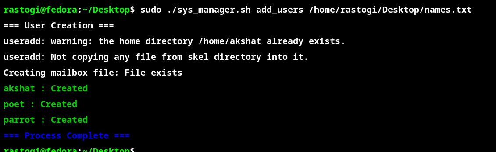

---

## 2. Setup Project Folders

**Command:**

```
./sys_manager.sh setup_projects rastogi 3
```

**Screenshot / Output:**

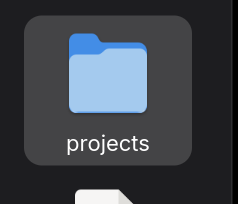
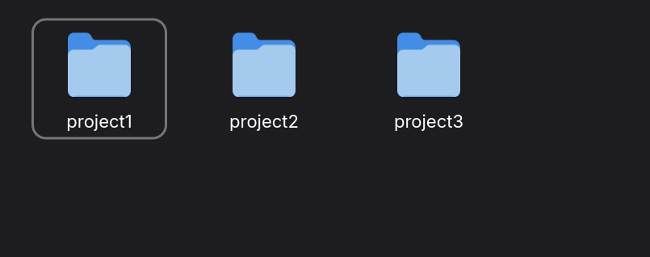
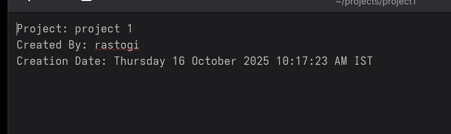
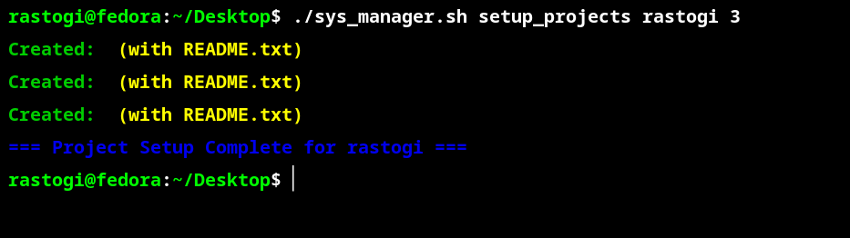

---

## 3. System Report

**Command:**
```
./sys_manager.sh sys_report rastogi /home/rastogi/outputfile.txt
```

**Screenshot / Output:**


---

## 4. Process Management

### a) List Zombie Processes

**Command:**
```
./sys_manager.sh process_manage rastogi list_zombies
```

**Screenshot / Output:**

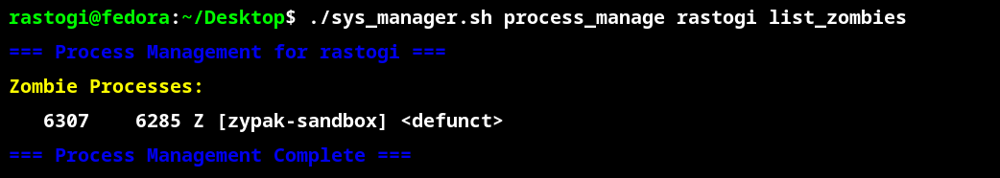

### b) List Stopped Processes

**Command:**
```
./sys_manager.sh process_manage rastogi list_stopped
```

**Screenshot / Output:**

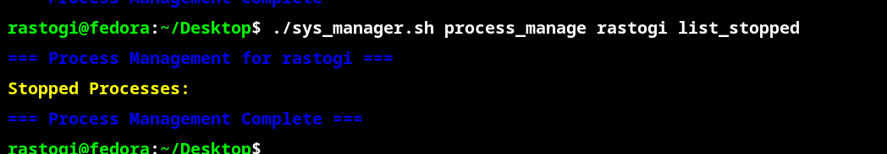

### c) Kill Zombie Processes (Warning)

**Command:**
```
./sys_manager.sh process_manage rastogi kill_zombies
```

**Screenshot / Output:**

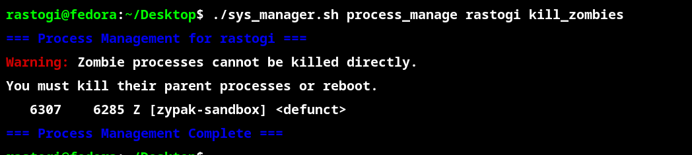


### d) Kill Stopped Processes


**Command:**
```
./sys_manager.sh process_manage rastogi kill_stopped
```


**Screenshot / Output:**


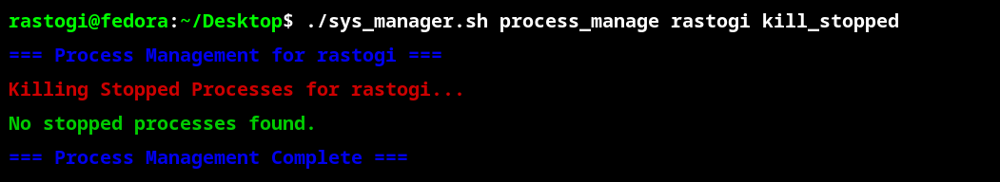


---


## 5. Permission & Ownership Manager


**Command:**
```
./sys_manager.sh perm_owner rastogi /home/rastogi/projects 755 rastogi rastogi
```


**Screenshot / Output:**


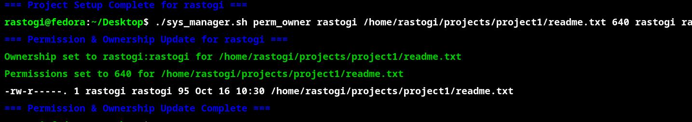


---
## 6. Help Menu


**Command:**
```
./sys_manager.sh help
```


**Screenshot / Output:**


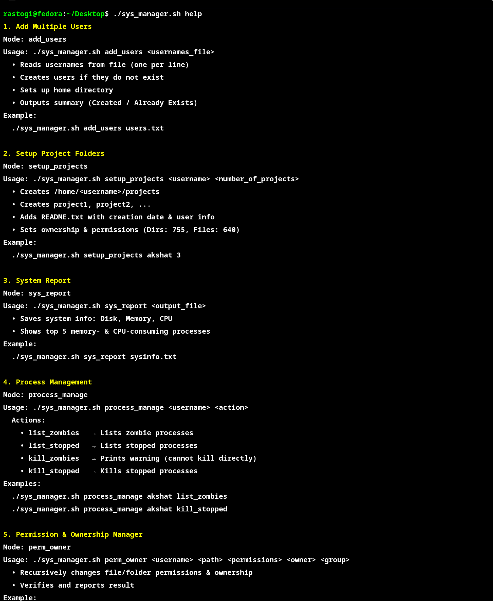


---
